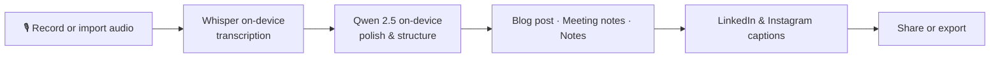

<div align="center">

# Voice Blogger

**Speak your ideas. Get a polished blog post — entirely on your iPhone.**

Record a voice note, walk away with a formatted blog post, meeting notes, or personal notes — plus ready-to-post LinkedIn and Instagram captions. No cloud. No API keys. No per-run cost. Your words never leave your device.

[](https://apps.apple.com/us/app/voice-blogger/id6777303710)
&nbsp;
[](https://apps.apple.com/us/app/voice-blogger/id6777303710)
&nbsp;
[](LICENSE)
&nbsp;
[](https://github.com/kavin0x/VoiceBlogger)

</div>

---

## Why Voice Blogger?

Most voice-to-text tools send your audio to the cloud. Most AI writing tools charge per token and store your prompts on someone else's servers.

Voice Blogger takes a different approach: **two small AI models download once to your iPhone, then everything runs locally** — transcription, rewriting, and social caption generation. Talk freely about sensitive topics, work offline after setup, and never worry about a monthly API bill.

| | Cloud tools | Voice Blogger |
|---|---|---|
| **Privacy** | Audio & text sent to servers | Stays on your device |
| **Cost** | Subscriptions or per-token fees | Free after download |
| **Offline** | Requires internet | Works offline after setup |
| **Account** | Usually required | None |

---

## How it works



1. **Record** — Tap the mic (or import an existing audio file). Live waveform, background recording, and Siri shortcuts supported.
2. **Transcribe** — [WhisperKit](https://github.com/argmaxinc/WhisperKit) runs OpenAI Whisper Medium entirely on the Neural Engine. Supports **90+ languages**.
3. **Generate** — [Qwen 2.5 1.5B](https://huggingface.co/mlx-community/Qwen2.5-1.5B-Instruct-4bit) (4-bit, via MLX) turns your rambling into structured writing. Watch it stream in real time.
4. **Publish** — Copy or share your blog post, meeting notes, or social captions.

---

## Who is this for?

- **Creators & founders** who think out loud and want a first draft without staring at a blank page
- **Meeting participants** who want clean notes from a debrief recording
- **Multilingual speakers** who record in Hindi, Spanish, French, or dozens of other languages and want English output (or keep the original language)
- **Privacy-conscious writers** who don't want their drafts on someone else's GPU

---

## Features

### Recording & transcription

- One-tap recording with a live waveform visualizer
- Background recording — keep talking while you switch apps
- Import existing audio files (`.m4a`, `.mp3`, `.wav`, and more)
- On-device transcription via Whisper Medium — no upload step
- 90+ languages; optional translate-to-English mode
- Siri Shortcuts: *"Start recording in Voice Blogger"*
- Live Activities & Dynamic Island progress during recording and model downloads
- Control Center widgets for quick start/stop

### Writing & social

- **Blog posts**, **meeting notes**, or **personal notes** — the app adapts structure to your content
- Optional beta: automatic content-type detection (Settings → Beta)
- Streaming generation — watch the text appear word by word
- Long recordings handled via chunked map-reduce (up to ~16k characters of transcript)
- LinkedIn post generation with platform-appropriate tone
- Instagram captions with hashtags (multiple variants)
- Full-text search across your history

### Privacy & storage

- No account, no analytics, no telemetry
- All recordings and generated content stored locally (SwiftData)
- Works fully offline after the one-time model download
- Open source — audit the code yourself

---

## Get started (iOS)

> **Requirements:** iPhone running iOS 18+ with ~2 GB free storage for on-device models.

1. **[Download Voice Blogger from the App Store](https://apps.apple.com/us/app/voice-blogger/id6777303710)**
2. On first launch, tap **Download Models** — grab a coffee; this takes a few minutes on Wi-Fi (~1.5 GB total)
3. Tap the microphone and start talking — or import an audio file from the toolbar
4. Stop recording — transcription begins automatically
5. Tap **Generate** and watch your post write itself
6. Switch to the LinkedIn or Instagram tab to generate social captions, then share

No signup. No API key. No cloud.

---

## Tech stack

Voice Blogger is built on Apple's on-device ML ecosystem:

| Layer | Technology |
|---|---|
| **iOS app** | SwiftUI, SwiftData, App Intents |
| **Speech-to-text** | [WhisperKit](https://github.com/argmaxinc/WhisperKit) · `openai/whisper-medium` |
| **Text generation** | [MLX Swift](https://github.com/ml-explore/mlx-swift) + [mlx-swift-lm](https://github.com/ml-explore/mlx-swift-lm) · `mlx-community/Qwen2.5-1.5B-Instruct-4bit` |
| **Model hosting** | [Hugging Face Hub](https://huggingface.co) (download only; inference is local) |
| **CLI (Mac)** | [mlx-whisper](https://github.com/ml-explore/mlx-examples/tree/main/whisper) + [Ollama](https://ollama.com) |

Models run on the **Apple Neural Engine** and GPU via Metal — fast, efficient, and private.

---

## CLI tool (Apple Silicon Mac)

A Python command-line companion lives in `cliTools/` for batch-processing audio files on **M1/M2/M3/M4 Macs**. It uses mlx-whisper for transcription and Ollama for blog polishing.

> **Note:** MLX requires Apple Silicon. The CLI does not run on Intel Macs, Linux, or Windows.

### Setup

```bash
cd cliTools

# Create a virtual environment (recommended)
python3 -m venv venv
source venv/bin/activate

# Install dependencies
pip install -r requirements.txt

# Install Ollama and pull a model
brew install ollama        # or download from https://ollama.com
ollama pull gemma4:e4b     # default; any capable model works
```

### Usage

```bash
python Transcribe_and_blog.py <audio_file> [options]
```

| Flag | Default | Description |
|---|---|---|
| `--language` | `hi` | Source language (ISO 639-1: `en`, `hi`, `es`, `fr`, …) |
| `--task` | `translate` | `translate` → English output · `transcribe` → keeps source language |
| `--model` | `gemma4:e4b` | Ollama model name (`ollama list` to see installed models) |
| `--no-instagram` | off | Skip Instagram caption generation |

### Examples

```bash
# Hindi audio → English blog + Instagram captions (defaults)
python Transcribe_and_blog.py ~/recordings/idea.m4a

# English podcast, keep original language, skip Instagram
python Transcribe_and_blog.py podcast.m4a --language en --task transcribe --no-instagram

# Spanish interview → English blog with a different model
python Transcribe_and_blog.py entrevista.mp3 --language es --task translate --model qwen2.5:14b
```

### Output

Given `my_recording.m4a`, three files are written under `cliTools/`:

| File | Contents |
|---|---|
| `Raw_Data/my_recording_raw.txt` | Raw Whisper transcript |
| `blog/my_recording_blog.md` | Polished blog post (Markdown) |
| `insta/my_recording_instagram.md` | Instagram captions with hashtags |

---

## Project structure

```
voiceblogger/
├── iOS App/VoiceBlogger/           # Native SwiftUI iOS app (main product)
│   ├── VoiceBlogger/
│   │   ├── Models/                 # SwiftData models & migrations
│   │   ├── Services/               # Audio, transcription, LLM, model downloads
│   │   ├── Views/                  # SwiftUI screens
│   │   ├── Utilities/              # Prompts, content detection, markdown
│   │   └── AppIntents/             # Siri Shortcuts
│   └── VoiceBloggerLiveActivities/ # Dynamic Island & Lock Screen widgets
├── cliTools/
│   ├── Transcribe_and_blog.py      # Python CLI for Mac
│   ├── requirements.txt
│   ├── Raw_Data/                   # CLI transcript output
│   ├── blog/                       # CLI blog output
│   └── insta/                      # CLI Instagram output
├── CONTRIBUTING.md
├── PrivacyPolicy.md
└── LICENSE
```

---

## Build from source (iOS)

Want to hack on the app or run it on your own device?

1. Clone the repo:
   ```bash
   git clone https://github.com/kavin0x/VoiceBlogger.git
   cd VoiceBlogger
   ```
2. Open `iOS App/VoiceBlogger/VoiceBlogger.xcodeproj` in Xcode 16+
3. Select your development team for code signing
4. Build and run on a physical iPhone (iOS 18+) — the simulator lacks Neural Engine support for full model inference
5. On first launch, download the bundled models from the in-app onboarding flow

See [CONTRIBUTING.md](CONTRIBUTING.md) for branch naming, commit style, and PR guidelines.

---

## FAQ

**Does my audio leave my phone?**
No. After the one-time model download from Hugging Face, all transcription and generation runs locally. See [PrivacyPolicy.md](PrivacyPolicy.md).

**How much storage do the models need?**
Roughly 1.5–2 GB total (Whisper Medium + Qwen 2.5 1.5B 4-bit).

**Can I use it on iPad?**
The App Store listing is iPhone-focused; iPad compatibility depends on the current App Store build.

**What languages are supported?**
Whisper supports 90+ languages for transcription. Blog generation output is primarily English, though you can transcribe in the original language with `--task transcribe` (CLI) or the in-app transcription mode.

**Why is generation slow on older iPhones?**
On-device LLM inference is CPU/GPU-bound. Newer chips with more Neural Engine throughput produce faster results. Long transcripts are automatically chunked.

**Is the CLI required?**
No. The iOS app is the main product. The CLI is a convenience for Mac users who want to batch-process existing audio files.

---

## Privacy

Voice Blogger is designed from the ground up for privacy:

- **No account required** — ever
- **No internet required** after first-time model download
- **No analytics or telemetry** collected
- **All audio and text stays on your device**
- **Microphone is the only permission** requested

Full details: [PrivacyPolicy.md](PrivacyPolicy.md)

---

## Contributing

Contributions are welcome — bug reports, feature ideas, docs improvements, and code.

1. Read [CONTRIBUTING.md](CONTRIBUTING.md)
2. Fork the repo and branch from `main` (`feat/…` or `fix/…`)
3. Open a pull request with a clear description and test steps

---

## License

[Apache License 2.0](LICENSE) — free to use, modify, and distribute.

---

<div align="center">

Made for people who think better out loud.

[](https://apps.apple.com/us/app/voice-blogger/id6777303710)

</div>
